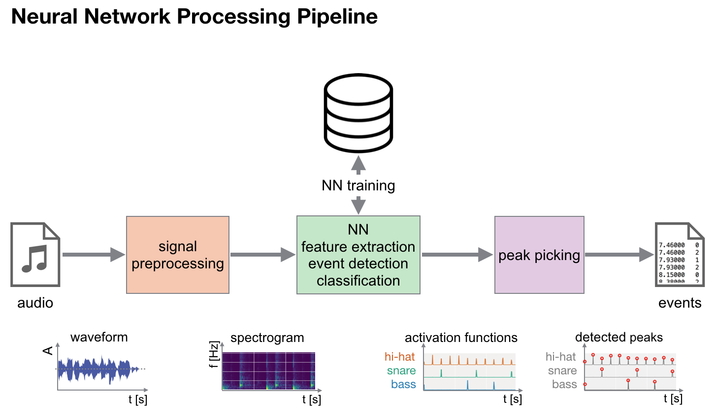
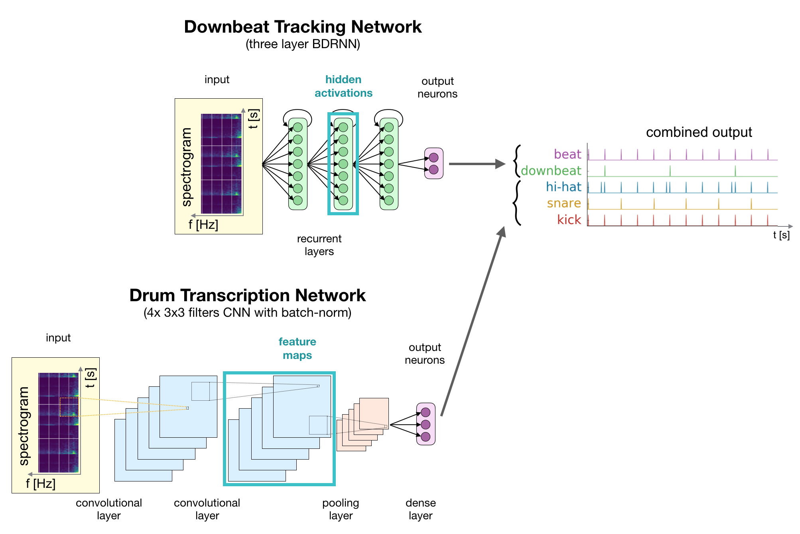
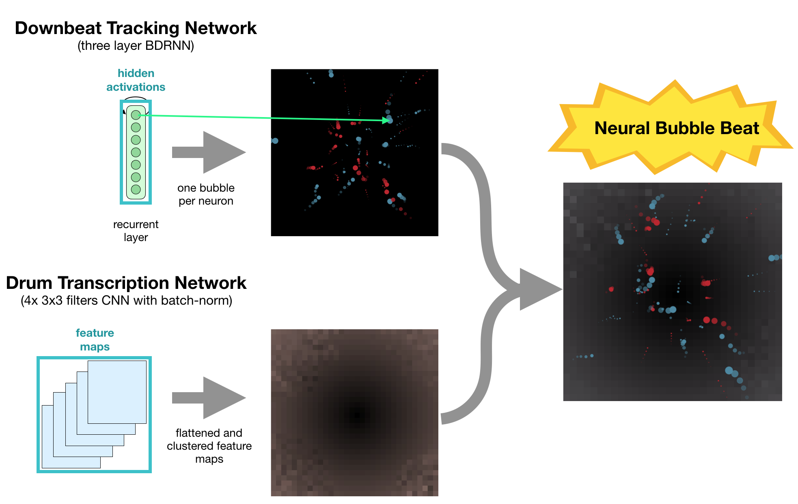
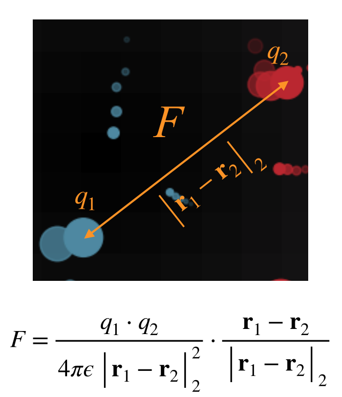

# Neural Bubble Beat

A hamr hack by: Florian Henkel,  Filip Korzeniowski, Matthias Dorfer, Richard Vogl

The aim of our hack is to provide an appealing, artistic visual interpretation of neural network activations while processing music.
We take a downbeat, drum transcription, and deep chroma network and use the activations of certain layers to control elements of the visualization.
A nice side effect of using the activations of hidden layers of neural networks is that the resulting visualization can provide insights into the inner working of these networks.

## Method

Visualizations for music need to somhow synchronize to events in the audio.
These events can be beats, chord changes, or percussive instrument onsets.
As mentioned, to control the visualization we use three different neural-network-based MIR approaches:
- A bidirectional RNN based downbeat tracking network [1]
- A CNN based drum transcription network [2]
- A deep chroma network [3]

  

 Figure 1: Processing pipeline of used neural network based approaches.

Figure 1 shows an overview of a processing pipeline using neural networks as main processing steps.
Such a pipeline is used by both the beat tracking and drum transcription method.

To realize the control of the visualization we utilize the hidden activations of certain layers.
In case of the beat tracking network, the activations of the second recurrent layer are used.
For the drum transcription CNN, the activations of the last convolution filters are extracted.
In case of the deep chroma net, we utilize the first two principal components of the output, which represents an embedded feature space.

  

 Figure 2: Network architectures with highlighted hidden activations in turquois which are used to control the visualization.

Figure 2 visualizes the network architectures while pointing out the positions of the layers from which the actications are extracted.
The deep chroma net is omitted for reasons of keeping the visualization simple, and because the output of the network is used.

  

 Figure 3: Hidden activations taken from the beat tracking network control the bubbles, by changing their virtual "electric charge", while hidden activations taken from the drum transcription network control the backroung lightness. 

The activations of the last features maps from the drum transcription network are clustered according to their activity and visualized as single pixels for the background of the visualization.
The first and second components of the PCA of outputs of an additional deep chroma net, control the hue and saturation of the background.
The main bubble visualization is controlled by the activations of the last recurrent layer of the beat tracking network, compare Figure 3.
Activations of each neuron represent a virtual "electric charge" which is used to calculate forces of attraction between the single bubbles according to Coloumb's law.
Additionally a gravitational force towards the screen center draws the particles (a.k.a. bubbles) back together, see Figure 4.

  

 Figure 4: The "electric charce" provided by the activations is used to calculate forces of attraction using Coloumb's law. 

The resulting visualization is synchronized to chord changes, beats and downbeats, as well as drum instrument onsets, as demonstrated by the example videos:

<video width="320" height="240" controls>
  <source src="doc/videos/output_bumbum_long.mp4" type="video/mp4">
Your browser does not support the video tag.
</video>
 
<video width="320" height="240" controls>
  <source src="doc/videos/output_electronic.mp4" type="video/mp4">
Your browser does not support the video tag.
</video>
 
<video width="320" height="240" controls>
  <source src="doc/videos/output_electronic.mp4" type="video/mp4">
Your browser does not support the video tag.
</video>

## References

[1] Sebastian Böck, Florian Krebs, and Gerhard Widmer. Joint beat and downbeat tracking with recurrent neural networks. In Proc. 17th International Society for Music Information Retrieval Conf (ISMIR), 2016. 
[2] Richard Vogl, Matthias Dorfer, Gerhard Widmer, and Peter Knees, “Drum transcription via joint beat and drum modeling using convolutional recurrent neural networks,” in Proc. 18th International Society for Music Information Retrieval Conference (ISMIR), Suzhou, China, 2017.  
[3] Filip Korzeniowski and Gerhard Widmer, “Feature Learning for Chord Recognition: The Deep Chroma Extractor,” in Proceedings of the 17th International Society for Music Information Retrieval Conference (ISMIR), New York, USA, 2016.  
